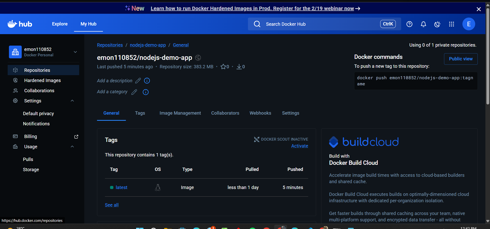

# Node.js CI/CD Demo App

## 📌 Project Overview

This is a simple Node.js web application that has been containerized using Docker and deployed on an AWS EC2 instance. The project is prepared for a CI/CD pipeline using GitHub Actions.

## 🚀 What I Did

* Created a simple Node.js application using Express
* Dockerized the application using a Dockerfile
* Built and pushed the Docker image to DockerHub
* Ran the Docker container on AWS EC2

## 🛠️ Tech Stack

* Node.js
* Express.js
* Docker
* AWS EC2
* DockerHub

## 📦 Docker Image

Pushed to DockerHub:

```
emon110852/nodejs-demo-app:latest
```

## ▶️ How to Run Locally (Optional)

### 1. Pull the image

```bash
docker pull emon110852/nodejs-demo-app:latest
```

### 2. Run the container

```bash
docker run -d -p 3000:3000 emon110852/nodejs-demo-app:latest
```

### 3. Open in browser

```
http://localhost:3000
```

## ✅ Status

Application successfully containerized and deployed.




